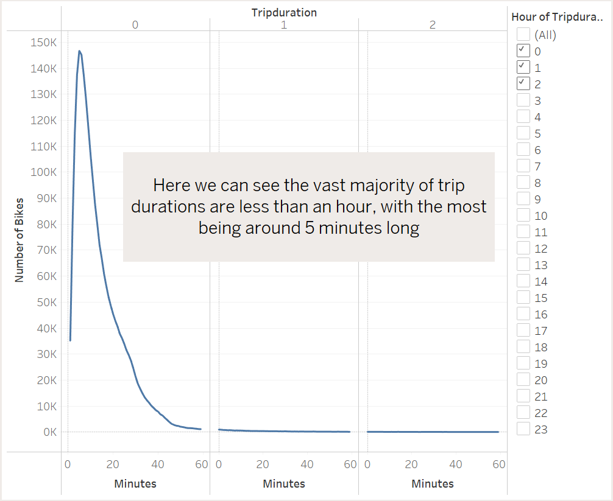
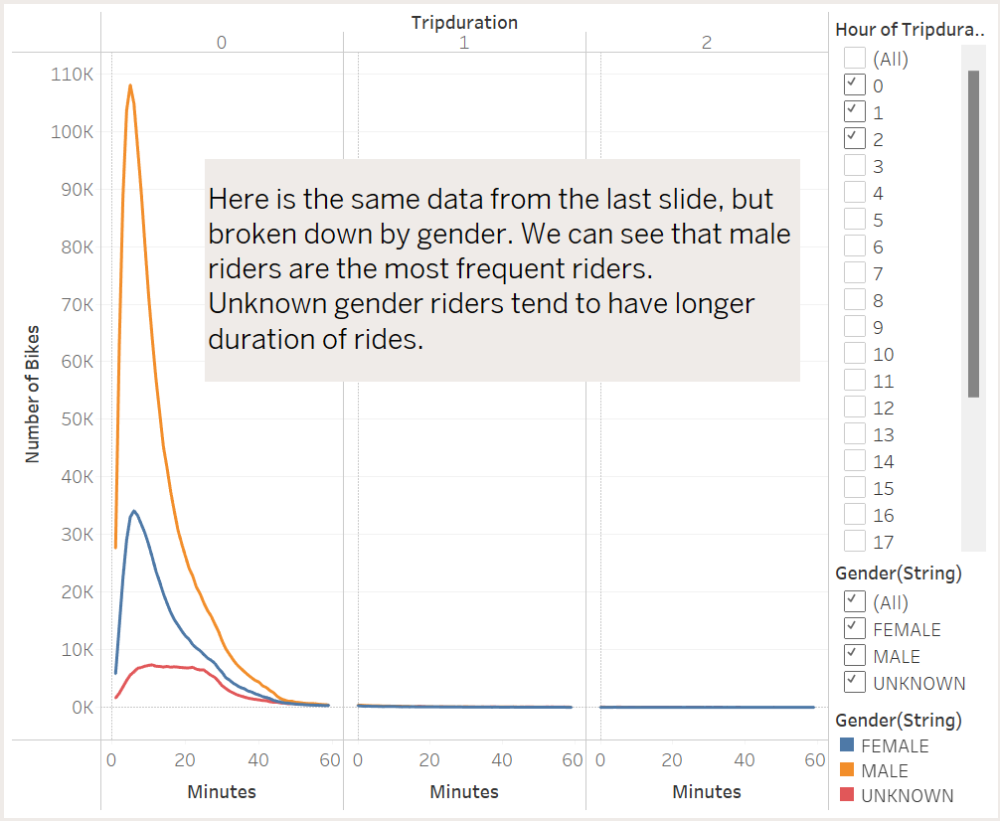
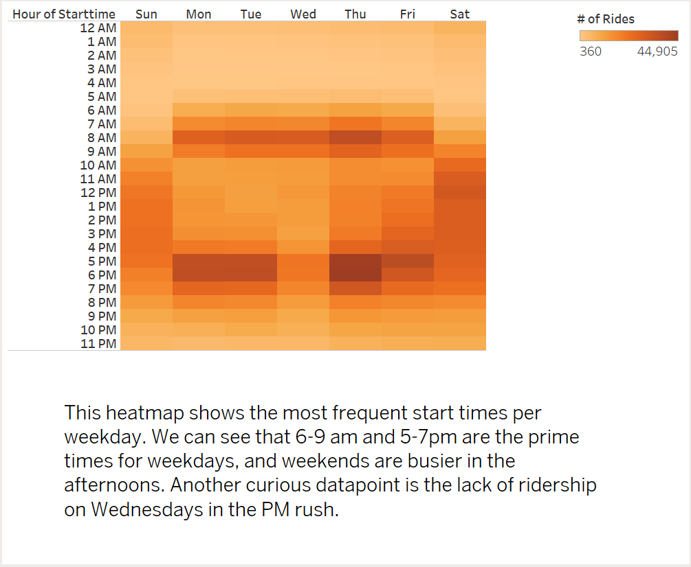
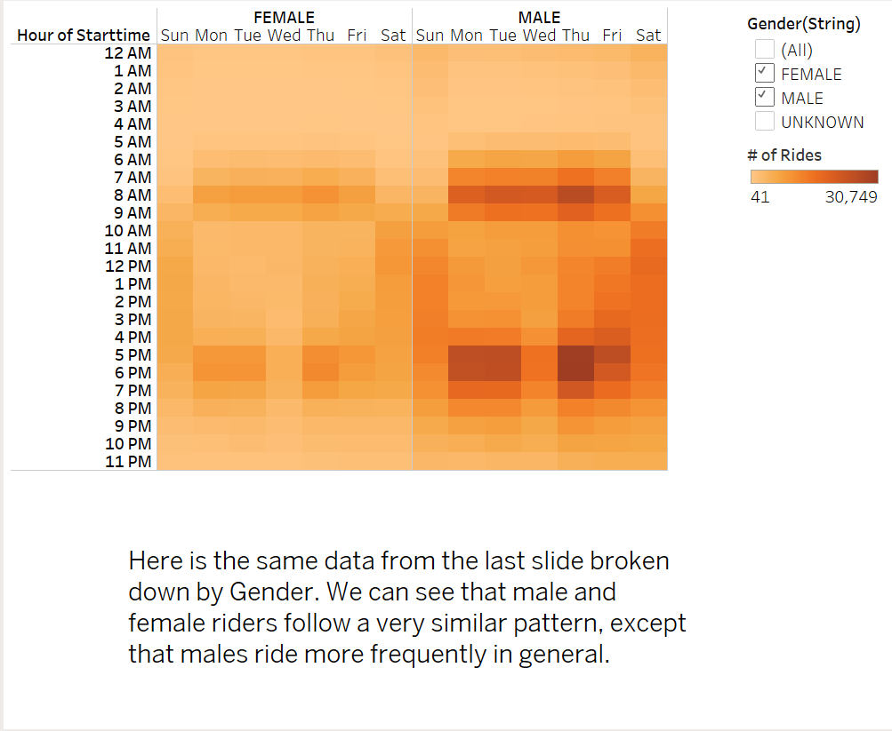
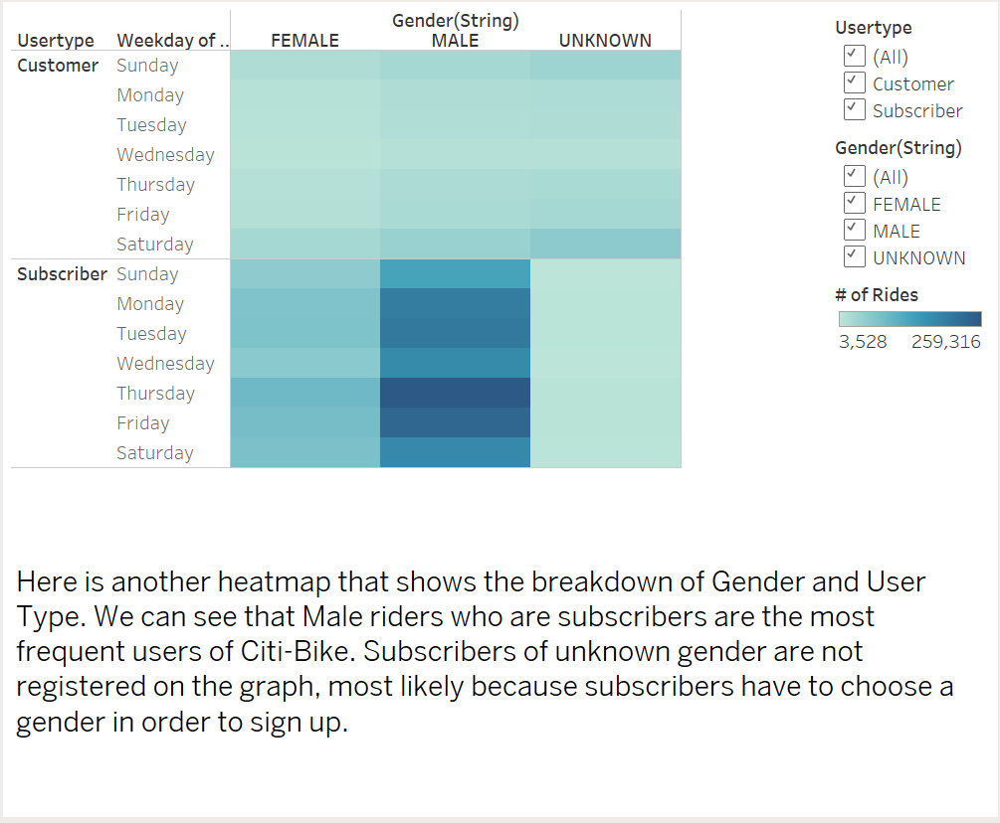
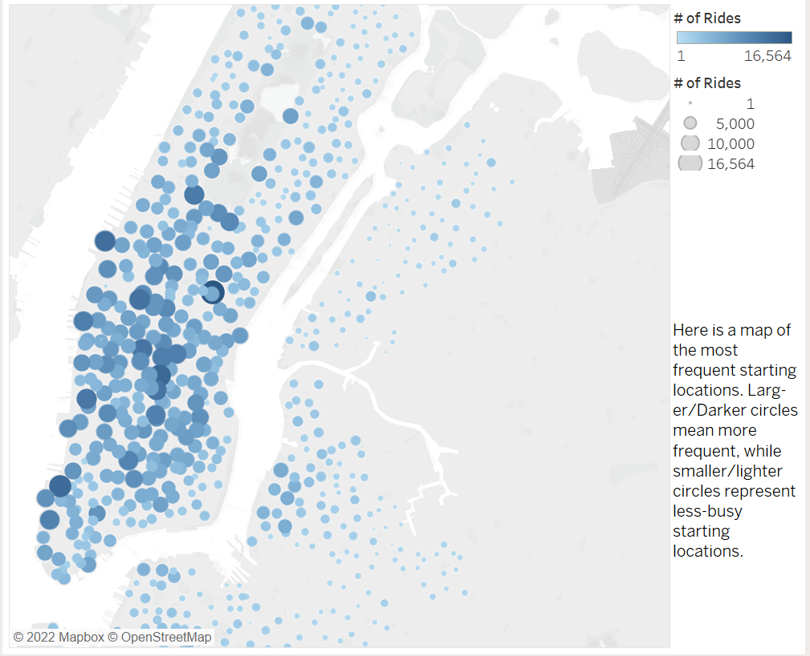
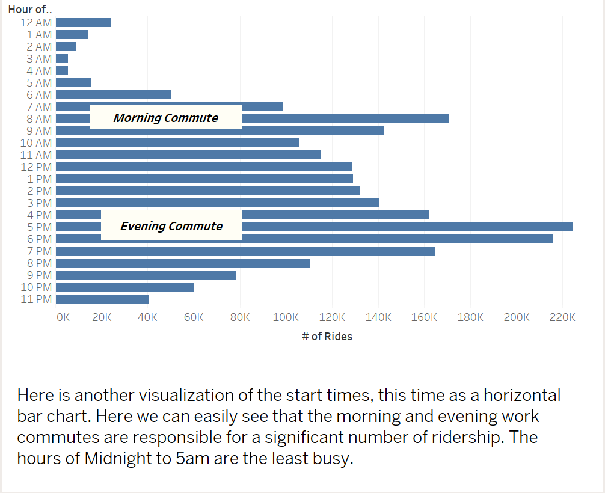

# NYC Citi-Bike with Tableau

## **[Link to Dashboard](https://public.tableau.com/app/profile/kevin.macdonald1186/viz/NYCCiti-BikeDashboard/NYCCiti-BikeStory)**

**Note: CSV and Excel files were omitted from the repository due to their large file size.**

## Overview of Analysis
The purpose of this analysis was to visualize the data from the NYC Citi-Bike company for August 2019 to show trends in riders' gender, popular start/end times, and popular start/end locations. 

## Results
I have included my results analysis for each visualization on the Tableau Story slides

## Summary
The data analyzed shows that the NYC Citi Bike service is primarily used by individuals who work and commute to the Manhattan area of NYC on weekdays. This is supported by the maps of start/ending locations heavily representing the Manhattan area, as well as the time of day data that shows morning and evening commutes are the busiest times. On weekends, the service is primarily used by tourists in the afternoon. 

### Additional analysis to be conducted
Examples of further data exploration are as follows

1. Chart the user type and the day of the week so we can see wether or not subscribed users are using the service on weekends, or if non-subscribers are predominantly using the service on weekends. 
2. Map the popular start and ending locations based on day of the week, so we can determine wether or not users are using the locations outside of Manhattan more often on the weekends.

With the two above examples of further data exploration we can plan an advertising campaign that encourages non-subscribers to use the service in Manhattan on weekdays, and encourage subscribers to use the service on weekends in the areas outside of Manhattan. 
